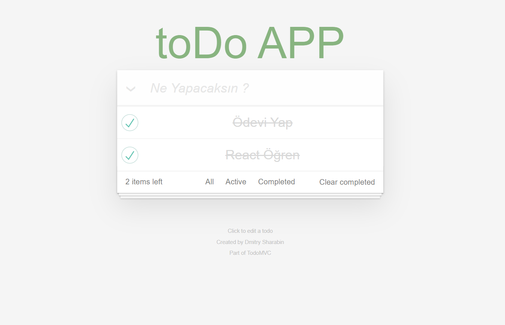

# toDo App

## [Patika.dev](https://academy.patika.dev/tr/profile) ve [Turkcell Geleceği Yazanlar](https://gelecegiyazanlar.turkcell.com.tr) eğitim platformlarında React konularını anlatan _"Mehmet Seven"_ hocamdan almış olduğum React Eğitimleriyle geliştirdiğim **todo list** projem.

### 1- Eklenen Todo'ları completed hale getirebilirsiniz veya delete edebilirsiniz.

### 2- Aşağıdaki butonlarda filtreleme ve silme seçeklerini kullanabilirsiniz.

| Hepsini Seç | Yapılmayan |  Yapılan  | Yapılan Görevleri Sil |
| ----------- | :--------: | :-------: | :-------------------: |
| - All -     |   Active   | Completed |    Clear Completed    |

